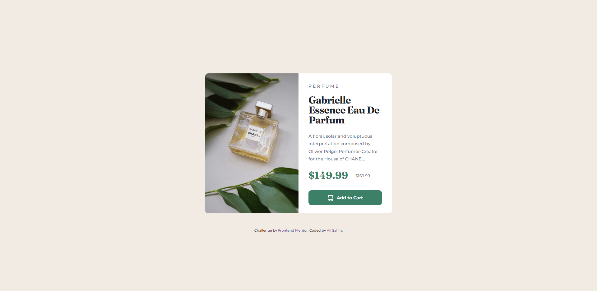

# Frontend Mentor - Product preview card component solution

This is a solution to the [Product preview card component challenge on Frontend Mentor](https://www.frontendmentor.io/challenges/product-preview-card-component-GO7UmttRfa). Frontend Mentor challenges help you improve your coding skills by building realistic projects.

## Table of contents

- [Overview](#overview)
  - [The challenge](#the-challenge)
  - [Screenshot](#screenshot)
  - [Links](#links)
- [My process](#my-process)
  - [Built with](#built-with)
- [Author](#author)

**Note: Delete this note and update the table of contents based on what sections you keep.**

## Overview

### The challenge

[Product preview card component challenge on Frontend Mentor](https://www.frontendmentor.io/challenges/product-preview-card-component-GO7UmttRfa)

The designs were created to the following widths:

- Mobile: 375px
- Desktop: 1440px

### Screenshot

### Links

- Solution URL: [Github](https://github.com/alisahindev/frontendMentor-challange-1/tree/main/Product%20preview%20card%20component#if-you-want-to-see-live-site-of-this-project-please-visit)
- Live Site URL: [CodeSandBox](https://codesandbox.io/s/wglt4s)

## My process

- Created a html and scss file
- Wrotten the css with Scss
- Scss file to compile to css
- Added css to the html file

### Built with

- HTML5
- CSS3 - SCSS
- Flexbox

## Author

- Frontend Mentor - [@alisahindev](https://www.frontendmentor.io/profile/alisahindev)
- Github - [@alisahindev](https://www.github.com/alisahindev)
